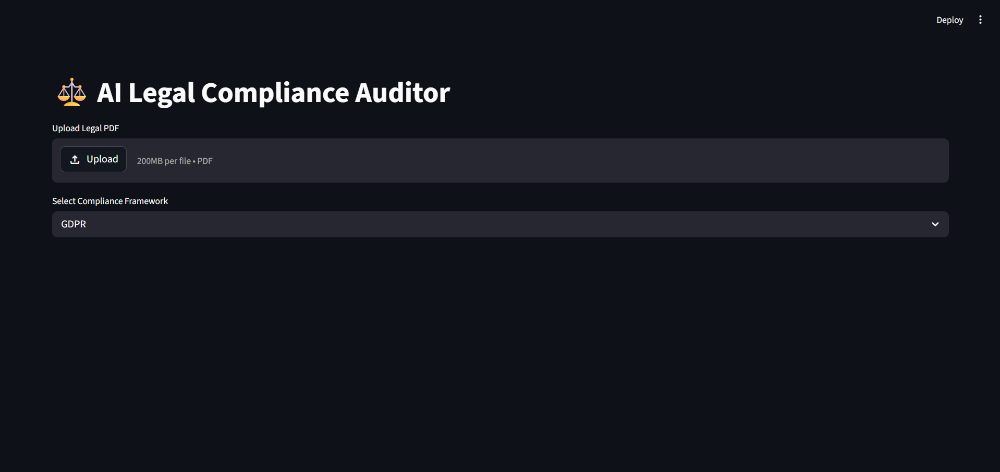
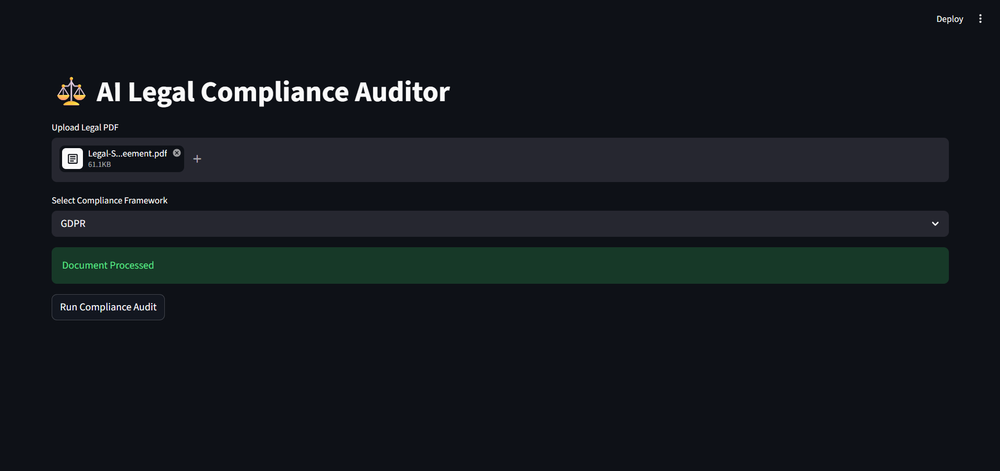
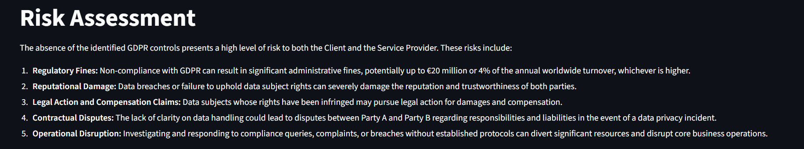
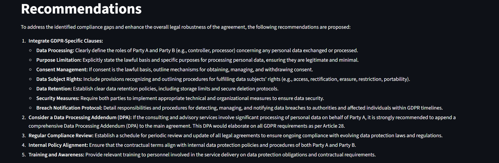

# LexAI

# ⚖️ Legal Compliance Auditor Using Generative AI

*An AI-powered compliance auditing platform that automates legal document analysis, identifies regulatory gaps, assesses risks, and generates actionable compliance reports using Generative AI, RAG, and Streamlit.*

---

## 📌 Table of Contents

* [Overview](#overview)
* [Business Problem](#business-problem)
* [Dataset](#dataset)
* [Tools & Technologies](#tools--technologies)
* [Project Structure](#project-structure)
* [Compliance Analysis Process](#compliance-analysis-process)
* [System Architecture & Workflow](#system-architecture--workflow)
* [Research Questions & Key Insights](#research-questions--key-insights)
* [Dashboard](#dashboard)
* [How to Run This Project](#how-to-run-this-project)
* [Future Enhancements](#future-enhancements)
* [Final Recommendations](#final-recommendations)
* [Author & Contact](#author--contact)

---

## Overview

This project automates legal and regulatory compliance auditing using Generative AI. It analyzes uploaded legal documents, compares them against compliance frameworks such as GDPR, DPDP, and ISO 27001, identifies missing controls, evaluates risk levels, and generates professional audit reports with actionable recommendations.

---

## Business Problem

Organizations must comply with multiple legal and security regulations to protect sensitive information and avoid penalties.

Traditional compliance audits are often:

* Time-consuming and expensive
* Dependent on legal experts
* Prone to human error
* Difficult to scale for large document repositories
* Challenging to maintain with constantly changing regulations

This project addresses these challenges through AI-powered automation.

---

## Dataset

The system uses rule-based compliance datasets stored in JSON format.

* GDPR Compliance Rules
* DPDP Compliance Rules
* ISO 27001 Security Controls

Dataset Files:

```text
data/
├── gdpr_rules.json
├── dpdp_rules.json
└── iso27001_rules.json
```

---

## Tools & Technologies

* Python
* Streamlit
* Google Gemini API
* ChromaDB
* Sentence Transformers
* DuckDuckGo Search
* PyPDF
* Python Dotenv
* Retrieval-Augmented Generation (RAG)
* GitHub

---

## Project Structure

```text
LEGALAI/
│
├── data/
│   ├── gdpr_rules.json
│   ├── dpdp_rules.json
│   └── iso27001_rules.json
│
├── app.py
├── compliance_rules.py
├── document_parser.py
├── report_generator.py
├── risk_engine.py
├── vector_store.py
├── web_research.py
│
├── requirements.txt
├── .gitignore
├── LICENSE
└── README.md
```

---

## Compliance Analysis Process

### Document Processing

* Upload legal documents in PDF format
* Extract and preprocess text content
* Split documents into semantic chunks

### Compliance Evaluation

* Load framework-specific compliance rules
* Compare document content against regulations
* Identify missing controls and compliance gaps

### Risk Assessment

* Calculate compliance score
* Categorize risks by severity
* Highlight critical compliance violations

### AI Report Generation

* Retrieve latest regulatory updates
* Generate AI-powered audit reports
* Provide recommendations and remediation strategies

---

## System Architecture & Workflow

```text
User Uploads PDF
        │
        ▼
Document Parsing
        │
        ▼
Text Chunking
        │
        ▼
Vector Embedding Generation
        │
        ▼
ChromaDB Storage
        │
        ▼
Compliance Rule Matching
        │
        ▼
Risk Assessment
        │
        ▼
Legal Web Research
        │
        ▼
Gemini AI Analysis
        │
        ▼
Audit Report Generation
        │
        ▼
Compliance Dashboard
```

---

## Research Questions & Key Insights

### 1. Is the uploaded document compliant?

* Detect missing regulatory requirements
* Verify required compliance controls
* Assess adherence to selected frameworks

### 2. What risks are present?

* High-risk violations
* Medium-risk compliance gaps
* Low-risk recommendations

### 3. Which controls are missing?

* Consent requirements
* Security policies
* Data governance controls
* Risk management procedures

### 4. How can compliance be improved?

* Strengthen policy coverage
* Implement missing controls
* Update governance practices
* Follow latest legal regulations

---

## Dashboard

The Streamlit dashboard provides:
### Home Page


### Document Processed


### Compliance Analysis


### Risk Dashboard


### Recommendation


---

## How to Run This Project

### Clone Repository

```bash
git clone https://github.com/yourusername/legal-compliance-auditor.git
cd legal-compliance-auditor
```

### Install Dependencies

```bash
pip install -r requirements.txt
```

### Configure API Key

Create a `.env` file:

```env
GOOGLE_API_KEY=your_api_key
```

### Run Application

```bash
streamlit run app.py
```

### Open Browser

```text
http://localhost:8501
```

---

## Future Enhancements

* Multi-language compliance auditing
* Real-time regulation monitoring
* Compliance chatbot assistant
* Advanced RAG pipeline
* Cloud deployment support
* Enterprise compliance management
* Historical audit tracking
* PDF report export

---

## Final Recommendations

* Maintain updated compliance datasets
* Integrate official legal databases
* Enhance explainability of AI findings
* Implement user authentication
* Support additional compliance frameworks
* Improve scalability for enterprise usage

---

## Author & Contact

### Rajalaxmi Biswal

**B.Tech Major Project**

Areas of Interest:

* Generative AI
* Legal Technology
* Compliance Automation
* Risk Assessment
* Data Governance

📧 Email: [rajalaxmibiswal2005@gmail.com](mailto:rajalaxmibiswal2005@gmail.com)

🔗 GitHub: https://github.com/rajalaxmibiswal
